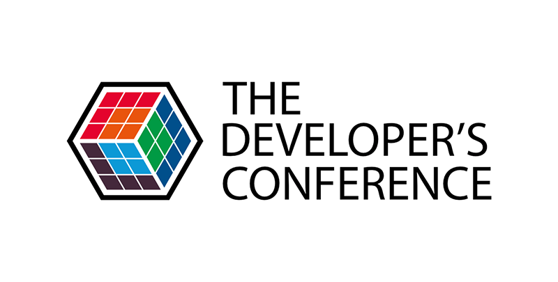

# Código para o evento TDC CONNECTIONS 2021
## Palestra: Clean Architecture no Flutter: da Teória a Prática

  

[Informações sobre o evento](https://thedevconf.com)

## Sobre o Projeto:
Projeto visa mostrar os conceitos de Clean Architecture aplicados na prática

### Tecnologias Utilizadas:

- [Clean Architecture](https://blog.cleancoder.com/uncle-bob/2012/08/13/the-clean-architecture.html)
- [Modular](https://github.com/Flutterando/modular)
- [MobX](https://pub.dev/packages/mobx)

### Como rodar:

- Versão do Flutter: 1.22.6
- Channel: stable
- Versão do dart: 2.10.5
